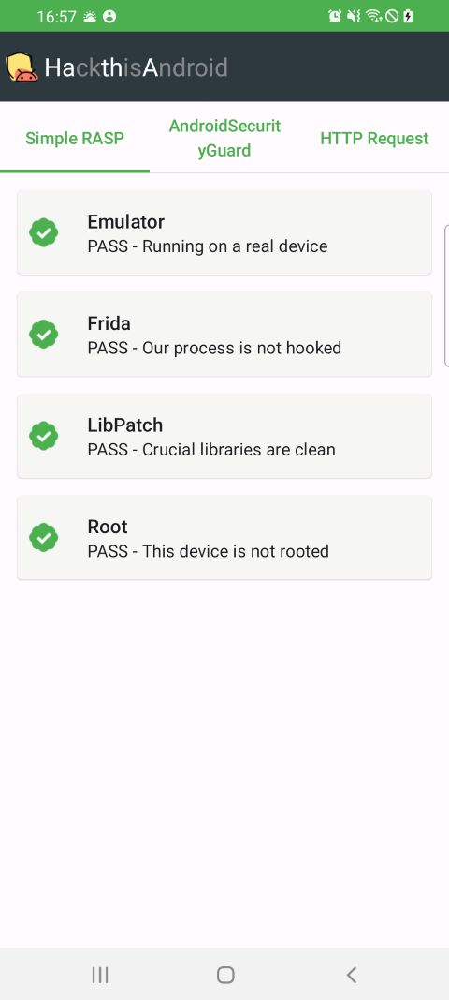
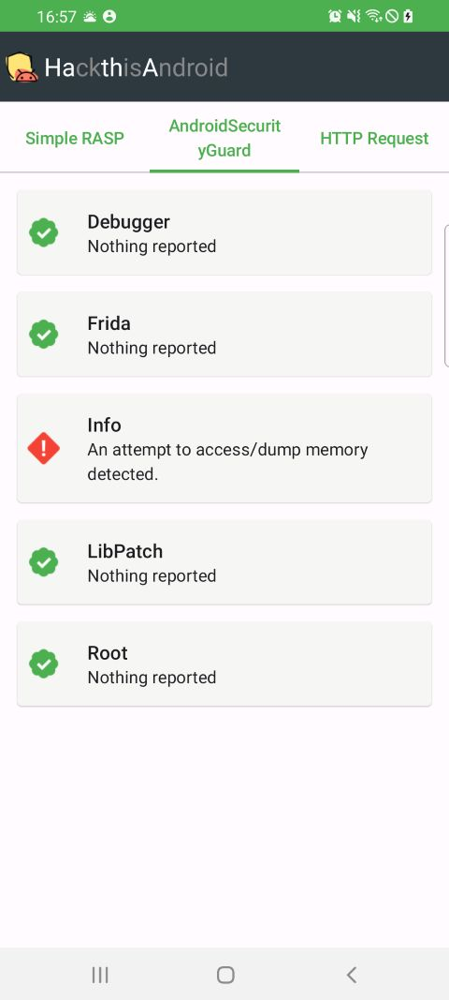
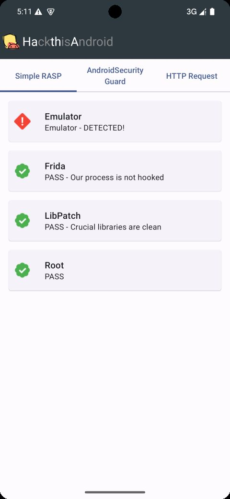
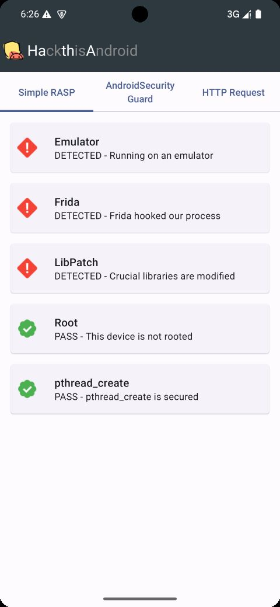
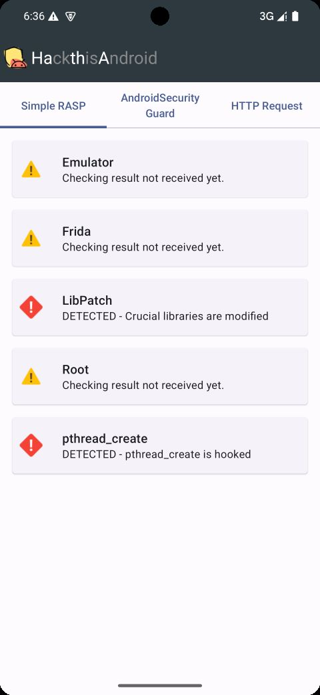
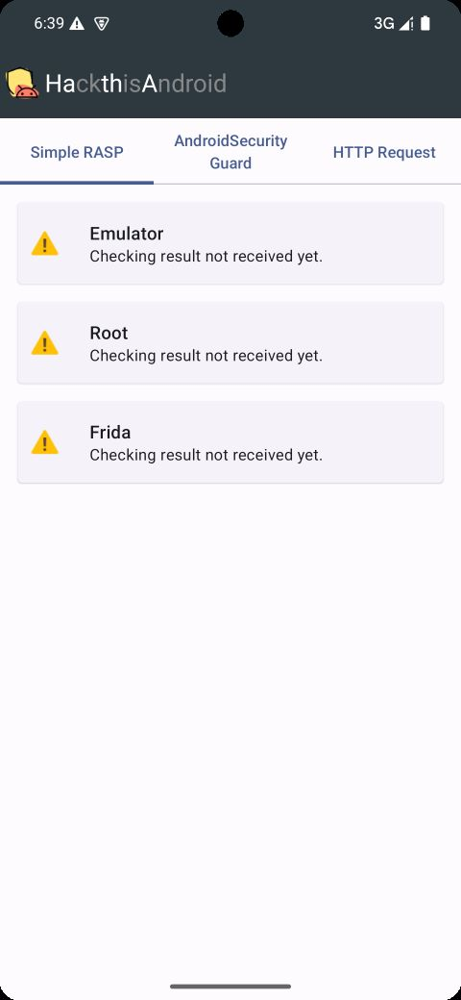
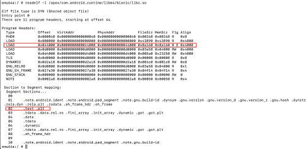
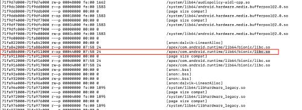

## Hack This Android!
This project is for testing your Android security development skills, as well as your hacking skill.

在这个项目里你可以同时练习你的android安全开发和入侵技能：
HathA App 实现了对frida、root、模拟器的检测，并且使用各种方式来保护apk，防止这些检测方法被绕过。
而frida-scripts里的脚本则尝试绕过HathA的各种安全检测。

compatible with frida 17
refer: https://stackoverflow.com/questions/79700740/frida-17-module-getexportbyname-typeerror-not-a-function

## Get started

### 1.运行正常的设备
在一台没有root的真机上运行的结果如图，有两个不同的库进行检查，一个叫SimpleRasp，另一个叫AndroidSecurityGuard，分别显示在不同的tab上

AndroidSecurityGuard是一个第三方库，代码在 https://github.com/aimardcr/AndroidNativeGuard

### 2.1 模拟器检测
SimpleRasp会在启动时通过pthread_create创建检测线程，循环检测当前时否运行在模拟器或root环境，如果是的话会在UI报警

### 2.2 frida检测
检测线程同时也会检测frida，使用了两种方式进行检查
 * 打开当前进程的内存映射文件/proc/self/maps，查看时否有frida或gadget相关的库被加载到内存中；
 * 查看/proc/self/task/文件夹，这个文件夹包含了当前进程的所有的线程信息；读取每一个线程的status文件，如果线程名包含gmain, gum-js-loop, pool-frida, gdbus这些和frida有关的字符，则表示frida hook了我们的进程；
可以使用 native_hook_libc_open.js 脚本来进行测试，这个脚本会hook libc库，并把对open方法的调用打印到终端；
当用这个脚本hook了进程时，可以看到SimpleRasp成功检测到了frida:

### 2.3 root检测
在模拟器上一般的进程没有权限调用su，所以在模拟器上检测root是通过的，这里暂时没有演示；

#### Attack!
攻击者可以通过noop pthread_create阻止检测线程的创建，见脚本 frida-scripts/simple/native_noop_pthread.js
参考:
 * https://bbs.kanxue.com/thread-285932.htm
 * https://bbs.kanxue.com/thread-284838.htm
Noop pthread_create之后的页面是这样的:

这时emulator检测和frida已经不会报警了，不过由于java层接收不到native的callback，所以会有warning
虽然emulator检测可以通过，但是可以看到SimpleRasp通过两种不同的方法都检查到了pthread_create()方法被修改了，详见下文。

### 3.检测pthread_create
为了防止关键的线程创建方法被修改，在启动的时候会用这个[文章](https://www.52pojie.cn/thread-1921073-1-1.html)介绍的方法进行检测。
代码见frida_function_hook_detection.cpp 

#### Attack!
由于我们只对 pthread_create() 进行了保护，攻击者可以通过修改 pthread_create() 调用的更底层的方法(如clone)来修改线程创建的逻辑。
参考这篇文章: https://bbs.kanxue.com/thread-285932.htm
可以使用脚本 frida-scripts/simple/native_bypass_pthread_hook_detection.js 来绕过对pthread_create()的保护

注意要测试hook clone，需要禁用LibPatch检测 -> 注释掉SimpleRasp.so的create_thread(doLibPatchDetection)这一行，因为LibPatch检测直接使用了clone，上述脚本修改clone方法会crash掉线程(这也是LibPatch对clone修改的防护)
运行脚本的结果:

可以看到由于线程没有启动，java层没有收到任何结果

### 4.检测so库内容时否被修改(LibPatch)
为了防止so库被hook，我们可以通过对比so文件可执行段，和加载到内存后的可执行段，来判断内存中的内容时否被修改了。
首先读取so的program header，获取可执行的段，读取并计算checksum，比如libc.so的program header是这样的: (通过readelf查看)

我们需要读取的是具有read和executable属性的段，也就是.plt和.text

然后读取我们线程的map文件/proc/self/maps，从里边找到需要检测的库对应的行，过滤出可执行的段(属性要带x)，比如：

然后读取这一段内存的内容并计算checksum

最后对比硬盘内容和内存内容的checksum时否一致来判断so时否被动态修改了。
可以通过

另外，为了多一层防护，防止pthread_create()函数被noop的情况，这个检测的线程是通过调用clone创建的；
如果使用上边的脚本去修改clone，整个app会crash。

#### 详细的文档见docs文件夹和项目wiki
